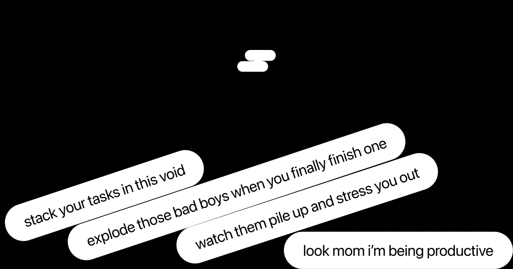
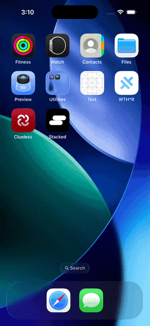
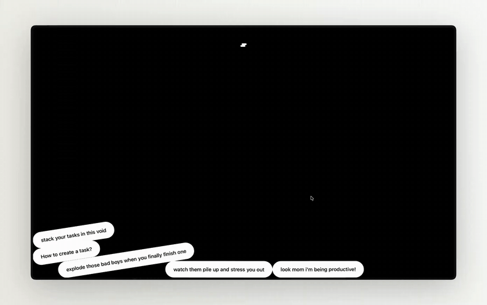

# A to-do app but you get to watch your tasks pile up.

## Preface
Most to-do apps are boring and bland and bad and functional. (ouu shi)
They prioritise functionality over fun which is *boooringgggggg*.

Stacked visualises each task in a pill, which acts like a real physics object with weight, bounce and friction, so you can watch your tasks pile up, stress you out in real time and do nothing about them. Once you finally do finish a task, it explodes RAHHHH.

## Interactions

### Phone

### Desktop

## Controls
 
| Action | Desktop | Mobile |
|---|---|---|
| Add a task | `⌘K` | Pull down from the top |
| Search | `⌘F` | Long-press background |
| Toggle view | `Tab` | Double-tap background |
| Complete a task | Hold the pill or double click task | Hold the pill or double tap task |
| Undo / Redo | `⌘Z` / `⌘⇧Z` | — |

I still need to implement undo / redo on mobile D:

---

Made with ❤️ by Ary